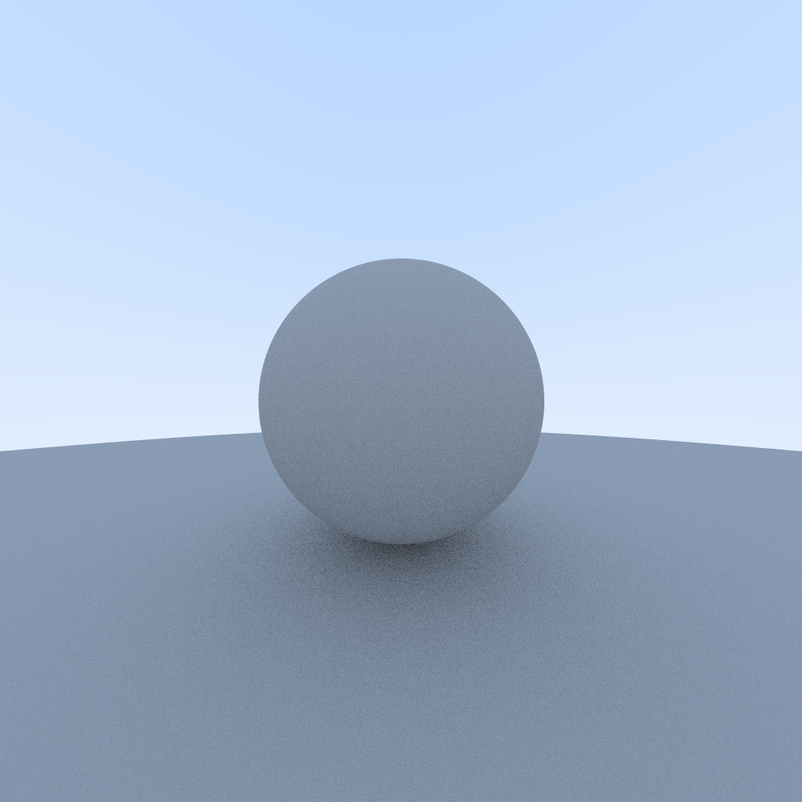

# Raytracing
The **Rust** version of [Ray Tracing in One Weekend](https://raytracing.github.io).

**NOTICE:** repo is under active development.

## Features
- Render from `.cfg` (a description format).
- **Material** and **Scene** System.
- Create mesh from **prefabs** or **glTF**.

## Showcase
- Raytracing in One Weekend

## References
- [Ray Tracing in One Weekend](https://raytracing.github.io)

## License
Licensed under the MIT license, check [LICENSE](LICENSE) for details.